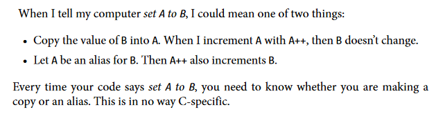

# Reference types and value types - [Home](index.md)

- [Reference types and value types - Home](#reference-types-and-value-types---home)
  - [In a nutshell](#in-a-nutshell)
  - [The basics](#the-basics)
  - [Why do reference types exist?](#why-do-reference-types-exist)
  - [The `ref` and `out` keywords](#the-ref-and-out-keywords)
  - [The stack and the heap](#the-stack-and-the-heap)

## In a nutshell
Consider this quote from Ben Klemens' book *[21st Century C: C Tips from the New School](https://www.amazon.co.uk/21st-Century-Tips-New-School/dp/1449327141)*.



Reference types and value types are how .NET handle this problem.

## The basics
There are two kinds of values in .NET: value types and reference types.

Value types follow the first bulletpoint in Klemens' quote. 
```
var a = 10;
var b = a;

Console.WriteLine(b); // outputs '10'

a++;

Console.WriteLine(b); // still outputs '10'
```

At the end of this codeblock, the value of `b` is still 10. When you set `b` to `a`, the value of `a` was copied over. There is no secret, invisible connection between the two variables: they are separate. If you do something to `a` - like increment it - `b` won't change.

Reference types follow the second bulletpoint in Klemens' quote.

```
Person John = new Person { Age = 20, Height = 5.6 };

Person Jane = John;

Console.WriteLine(Jane.Age); // outputs '20'

John.Age = 28;

Console.WriteLine(Jane.Age); // outputs '28'
```

When we set `Jane` equal to `John`, we are making it an *alias* for `John`.
When you change something in `John`, `Jane` also changes. If you changed something in `Jane`, then `John` would change too.

## Why do reference types exist?
Reference types are confusing to most beginners. The idea of having multiple variables that all share the same information seems somewhat pointless.

(If you believe this very strongly, you might enjoy learning a language like [Rust](https://www.rust-lang.org/).)


## The `ref` and `out` keywords
These keywords let you treat the arguments to a method like reference types, even if they're actually a value type. This lets you modify an `int` and have your changes affect the code that called the method in the first place.

If you think using one of these keywords is the best way to solve a problem, you are probably wrong. They are not used very often. The most common place you will see them is when using a method like [Int.TryParse](https://docs.microsoft.com/en-us/dotnet/api/system.int32.tryparse?view=net-5.0).

The difference between `ref` and `out` is subtle and not very important.

## The stack and the heap
If you have looked up reference and value types before, you have probably heard something like this:

*"Reference types live on the heap, value types live on the stack."*

This is correct, to an extent, but I don't think it's useful for understanding ref/val types on a basic level. I highly recommend reading Raymond Chen's article [*The Stack is an Implementation Detail*](https://docs.microsoft.com/en-us/archive/blogs/ericlippert/the-stack-is-an-implementation-detail-part-one) for more information on this.