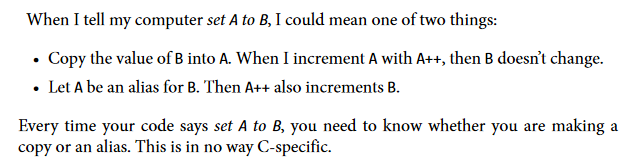

<!-- title: Reference types and value types -->
# Reference types and value types - [Home](../index.md)

- [Reference types and value types - Home](#reference-types-and-value-types---home)
  - [In a nutshell](#in-a-nutshell)
  - [The basics](#the-basics)
  - [In .NET, reference and value types are pre-determined](#in-net-reference-and-value-types-are-pre-determined)
  - [Why do reference types exist?](#why-do-reference-types-exist)
  - [The `ref` and `out` keywords](#the-ref-and-out-keywords)
  - [The stack and the heap](#the-stack-and-the-heap)

## In a nutshell

Consider this quote from Ben Klemens' book *[21st Century C: C Tips from the New School](https://www.amazon.co.uk/21st-Century-Tips-New-School/dp/1449327141)*.



Reference types and value types are how .NET handle this problem.

## The basics

There are two kinds of values in .NET: value types and reference types.

Value types follow the first bulletpoint in Klemens' quote.

```csharp
var a = 10;
var b = a;

Console.WriteLine(b); // outputs '10'

a++;

Console.WriteLine(b); // still outputs '10'
```

At the end of this codeblock, the value of `b` is still 10. When you set `b` to `a`, the value of `a` was copied over. There is no secret, invisible connection between the two variables: they are separate. If you do something to `a` - like increment it - `b` won't change.

Reference types follow the second bulletpoint in Klemens' quote.

```csharp
Person John = new Person { Age = 20, Height = 5.6 };

Person Jane = John;

Console.WriteLine(Jane.Age); // outputs '20'

John.Age = 28;

Console.WriteLine(Jane.Age); // outputs '28'
```

When we set `Jane` equal to `John`, we are making it an *alias* for `John`.
When you change something in `John`, `Jane` also changes. If you changed something in `Jane`, then `John` would change too.

## In .NET, reference and value types are pre-determined

In some languages, like C++, you can treat any variable as a value or a reference type at any time.

In C#, you can't. This decision is already made for you in the type itself. An `int` will always be a value type. A `StringBuilder` will always be a reference type.

> ⚠️ There are ways to 'box' a value type so it becomes a reference type, like with [nullable value types](https://docs.microsoft.com/en-us/dotnet/csharp/language-reference/builtin-types/nullable-value-types). But this does not change the underlying type. Putting a shirt in a suitcase makes it easier to carry around, but the shirt doesn't change.

As a rough guide, the following things are value types:

- Primitives (`int`, `double`, `bool`, `char`)
- Structs
- Tuples
- Enums

Everything else is a reference type:

- Classes
- Interfaces
- Delegates
- Records

You have to memorise this.

Incidentally, `string` is a [reference type that acts like a value type](https://stackoverflow.com/questions/636932/in-c-why-is-string-a-reference-type-that-behaves-like-a-value-type). This is interesting to know about but has little impact on real-world coding.

## Why do reference types exist?

Reference types are confusing to most beginners. The idea of having multiple variables that all share the same information seems somewhat pointless.

(If you believe this very strongly, you might enjoy learning a language like [Rust](https://www.rust-lang.org/).)

Reference types let methods change objects without having to return a new version of that object.

```csharp
public void ClampAge(User user)
{
    if (user.Age < 0)
    {
        user.Age = 0;
    }
    if (user.Age > 100)
    {
        user.Age = 100;
    }
}

public void CreateUser(int age, string name)
{
    var user = new User(age, name);
    ClampAge(user);
    SaveUserToDatabase(user);
}
```

Because `User` is a reference type, the `ClampAge` can directly modify the same object that `CreateUser` is working on. If `User` was a value type, our code would look like this:

```csharp
public User ClampAge(User user)
{
    if (user.Age < 0)
    {
        user.Age = 0;
    }
    if (user.Age > 100)
    {
        user.Age = 100;
    }

    return user;
}

public void CreateUser(int age, string name)
{
    var user = new User(age, name);
    user = ClampAge(user);
    SaveUserToDatabase(user);
}
```

This adds meaningless complexity.

Reference types let us easily work on the same object across different pieces of code without having to pass it back and forth as much.

## The `ref` and `out` keywords

These keywords let you treat the arguments to a method like reference types, even if they're actually a value type. This lets you modify an `int` and have your changes affect the code that called the method in the first place.

If you think these keywords are the best way to solve a problem, you are probably wrong. They are not used very often. The most common place you will see them is a method like [Int.TryParse](https://docs.microsoft.com/en-us/dotnet/api/system.int32.tryparse?view=net-5.0).

Most of the time, if you want a value type to act like a reference type, you should just create a new reference type instead.

The difference between `ref` and `out` is subtle and not very important.

## The stack and the heap

You may have heard something like this before:

*Reference types live on the heap, value types live on the stack.*

This is mostly correct, but I have avoided talking about the stack and the heap so far.

The stack and the heap are *implementation details*. They are not hard and fast rules of the universe. .NET happens to use these abstractions, but it could have also implemented reference types and value types in a completely different way.

I highly recommend reading Raymond Chen's article [*The Stack is an Implementation Detail*](https://docs.microsoft.com/en-us/archive/blogs/ericlippert/the-stack-is-an-implementation-detail-part-one) for more information on this.

I will explain the stack and the heap in another page.
